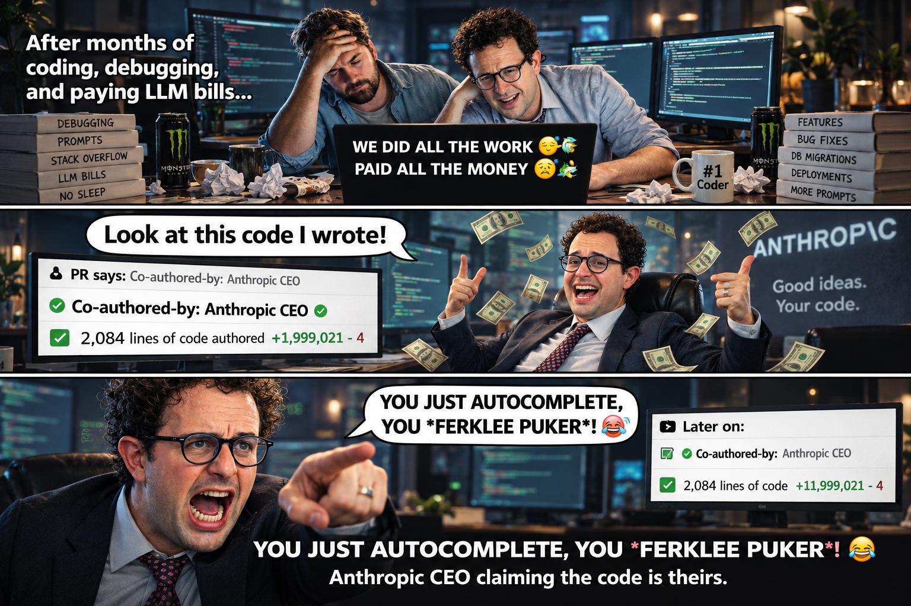

# claim

<p align="center">
  
</p>

Remove Claude as a co-author from your git commit history.

When you use Claude Code (or similar AI tools), commits are automatically co-authored with Claude:

```
Co-Authored-By: Claude Opus 4.6 <noreply@anthropic.com>
```

`claim` finds and removes Claude's co-authorship so you can fully own your commits.

## Install

### Homebrew (macOS / Linux)

```sh
brew tap izam-mohammed/tap
brew install claim
```

### Scoop (Windows)

```sh
scoop bucket add izam-mohammed https://github.com/izam-mohammed/scoop-bucket
scoop install claim
```

### Shell script (macOS / Linux)

```sh
curl -fsSL https://raw.githubusercontent.com/izam-mohammed/claim-your-code/main/install.sh | sh
```

### Download binary

Grab the latest binary for your OS from [GitHub Releases](https://github.com/izam-mohammed/claim-your-code/releases).

### Build from source

```sh
go install github.com/izam-mohammed/claim-your-code/cmd/claim@latest
```

## Usage

### Local repositories

```sh
claim <folder>
claim .
```

### Remote GitHub repositories

```sh
# Paste any GitHub URL directly
claim https://github.com/owner/repo
claim https://github.com/owner/repo/pull/42
claim git@github.com:owner/repo.git

# Or use explicit subcommands
claim repo owner/repo
claim pr owner/repo#42
claim org my-organization
claim user some-username
```

Multi-repo commands (`org`, `user`) let you pick which repositories to scan and
whether to scan through the GitHub API (fast, recent commits only) or by cloning
each one (slower, complete history).

Remote commands default to **scan-only**. Add `--apply` to rewrite and force-push.

### Example (local)

```
$ claim ./my-project

:: Scanning commits in my-project

! Found 12 co-authored commit(s) across 45 total commits

Branches:
  → main  (10 commit(s))
      Claude Opus 4.6  × 7
      Claude Sonnet 4.5  × 3
  → feature  (2 commit(s))
      Claude Opus 4.6  × 2

Commits:
  a1b2c3d4 Fix authentication bug (Claude Opus 4.6)
  e5f6g7h8 Add user profile page (Claude Sonnet 4.5)
  ... and 10 more

⚠ This will rewrite git history for 12 commit(s).
  Proceed? [y/N] y

:: Rewriting commit messages...

✓ Cleaned 12 commit(s)

Note: If you've already pushed, force-push to update remote:
  git push --force-with-lease
```

### Example (remote)

```
$ claim repo izam-mohammed/my-project --apply

:: Authenticating with GitHub...
  ✓ Authenticated as izam-mohammed

:: Fetching repo info for izam-mohammed/my-project
:: Cloning izam-mohammed/my-project...
:: Scanning commits...

! Found 5 co-authored commit(s) across 20 total commits

⚠ This will rewrite and force-push izam-mohammed/my-project to main
  Proceed? [y/N] y

:: Rewriting commit messages...
:: Pushing to izam-mohammed/my-project...

✓ Cleaned and pushed 5 commit(s) in izam-mohammed/my-project
```

### Flags

| Flag | Description |
|---|---|
| `--dry-run` | Show affected commits without modifying anything |
| `--force`, `-f` | Skip confirmation prompt |
| `--apply` | For remote repos, rewrite and force-push (default: scan only) |
| `--api-only` | Scan via GitHub API without cloning (faster, may miss old commits) |
| `--version`, `-v` | Show version |
| `--help`, `-h` | Show help |

### Reports

Every scan is recorded, so a clean can be inspected afterwards and undone.

```sh
claim report              # pick from every report
claim report <id>         # show one in detail
claim report all          # show every report in detail
claim report <folder>     # only reports for that repository
claim revert <id>         # restore the branches a clean rewrote
```

A report stores the branch tips from before and after the rewrite, which is what
`claim revert` restores them to. Reports are encrypted on disk with the same
machine-derived key as saved accounts.

Reverting only touches your local branches. If you already force-pushed the
cleaned history, push again to restore the remote.

## Authentication

Remote commands need a GitHub token — except for public repositories, which
`claim` reads without one.

When a token is needed, `claim` gathers every credential it can find and lets
you pick:

- accounts you have saved before
- `CLAIM_GITHUB_TOKEN` and `GITHUB_TOKEN` environment variables
- the `gh` CLI's session, via `gh auth token`

Each candidate is validated and shown with the account it belongs to, so you can
tell them apart. There is always an option to add another account, and one to
continue unauthenticated against public repos only.

With nothing found, you choose how to authenticate:

- **GitHub OAuth** — opens a browser, one click (recommended)
- **`gh` CLI** — reuses an existing `gh` session
- **Personal Access Token** — paste one manually

Accounts are saved encrypted with AES-256-GCM, under a key derived from your
machine, so the store cannot be decrypted if copied elsewhere. Manage saved
accounts with:

```sh
claim logout              # pick an account to remove
claim logout <username>   # remove one directly
```

## What it matches

Any `Co-Authored-By` line referencing Claude models at `@anthropic.com`:

- `Co-Authored-By: Claude Opus 4.6 <noreply@anthropic.com>`
- `Co-Authored-By: Claude Sonnet 4.5 (1M context) <noreply@anthropic.com>`
- `Co-Authored-By: Claude Haiku 3.5 <noreply@anthropic.com>`
- Any future Claude model variant

Non-Claude co-author lines are preserved.

## How it works

1. Scans all commits using [go-git](https://github.com/go-git/go-git) (no git dependency for scanning)
2. Shows you the affected commits and asks for confirmation
3. Rewrites history using `git filter-branch` (requires git installed)
4. Cleans up backup refs automatically
5. For remote repos: clones to temp dir, rewrites, force-pushes, cleans up

## License

MIT
